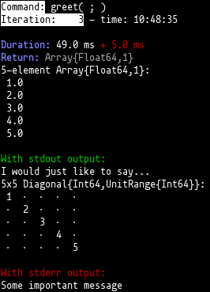
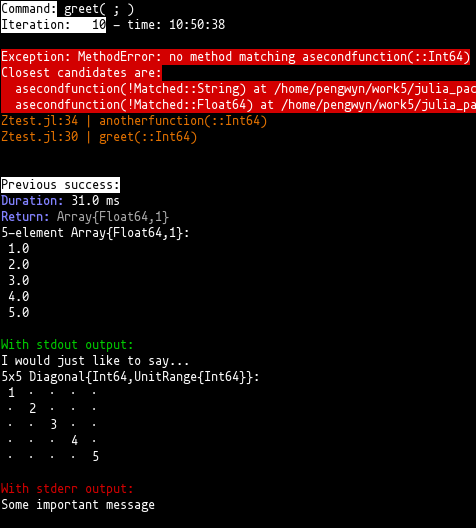
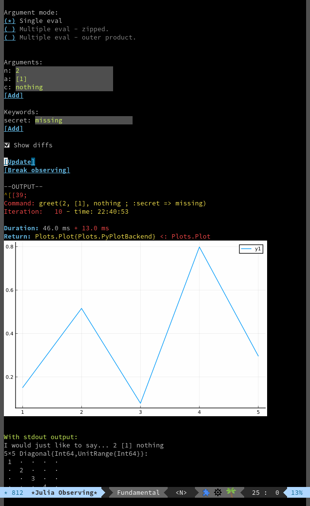

# FunctionObserving

<!-- [](https://pengwyn.github.io/FunctionObserving.jl/stable) -->
<!-- [](https://pengwyn.github.io/FunctionObserving.jl/dev) -->
[](https://travis-ci.com/pengwyn/FunctionObserving.jl)

This package is aimed at removing the manual aspects of the typical programming
change-check cycle, usually invoked by 

1. edit
1. save
1. `<alt-tab>`
1. `<up-arrow><enter>`
1. curse/scream/yell/despair
1. `<alt-tab>`
1. Continue from step 1...

## Using

Invoke the macro `@observe` on a function call. The documentation is:


```julia
@observe func(args... ; kwds...)
```
Use `Revise` to "observe" changes to a functions behaviour. This will track the
return values and the stdout/stderr of the function.
    
Notes:
* This only tracks stdout, stderr output using `redirect_stdxxx`. Many functions
  (e.g. `display`) will not output to the current stdout and so will not be captured.
* "Repeats" are recorded. Two calls repeat, when they have the same output.
* Currently, any change to the function's module will cause the function to be retested.
* This will probably only work on linux at the moment...

### Example output


### Example with exception


## Future ideas

* Diffs of output and returned values.
* Multiple input arguments to test several cases at once.


## Inspiration

This idea was inspired by Brett Victor's talk "Inventing on Principle":
https://www.youtube.com/watch?v=8QiPFmIMxFc

# Emacs support

See the emacs package [julia-funcobs](https://github.com/pengwyn/julia-funcobs)
for an IDE-like interface with `julia-repl`. Includes image support from
`Plots.jl`.


